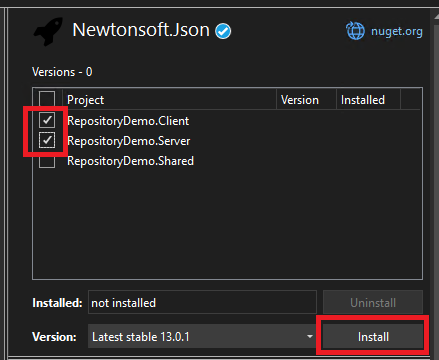
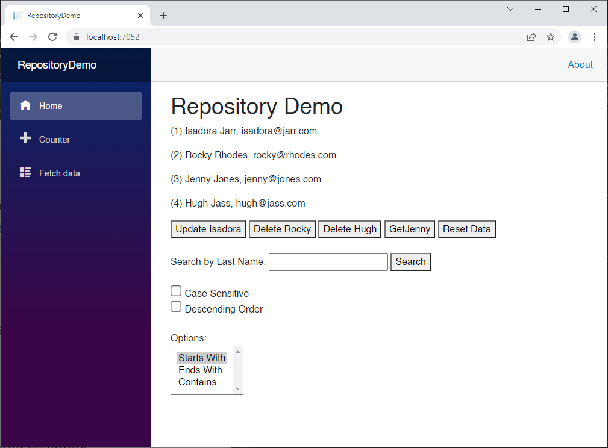
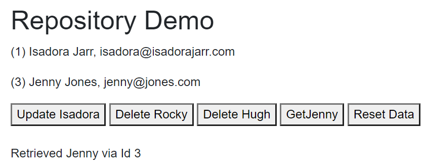
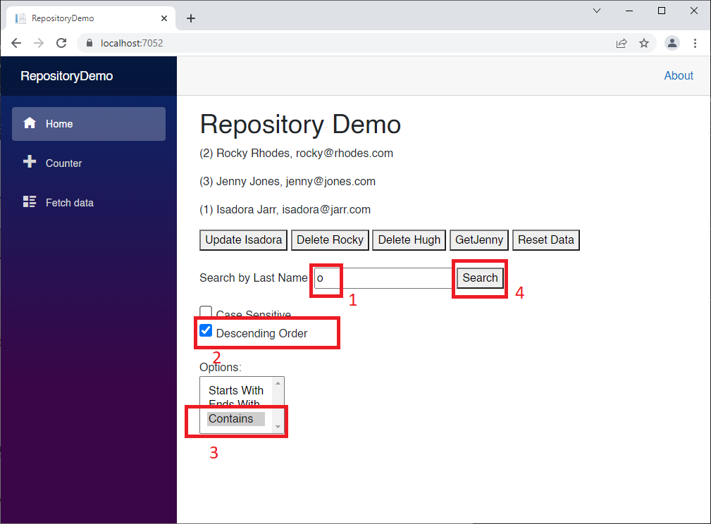
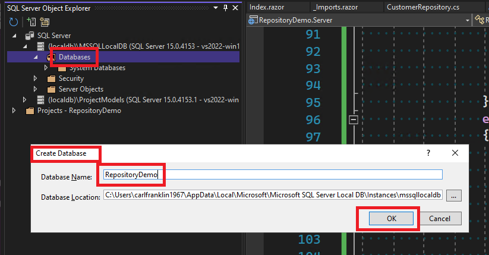
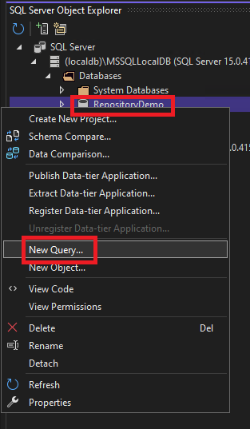
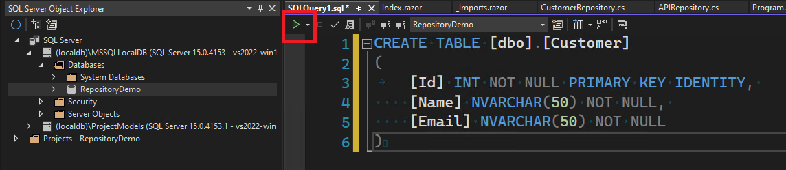
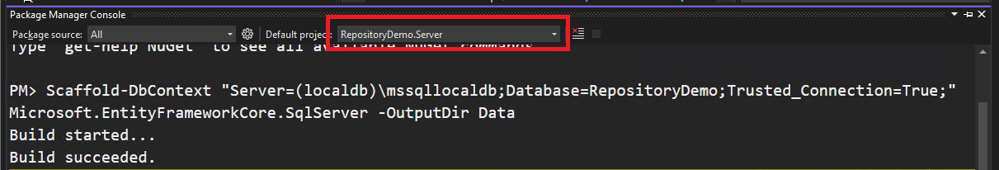
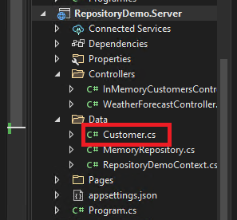
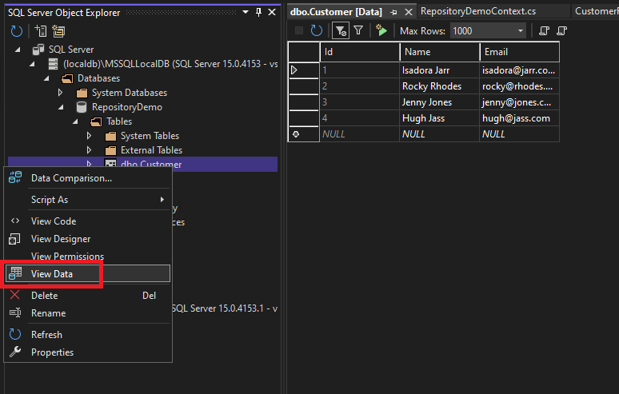

# Building Reusable Back-End Repositories

## Overview

In this module, we will create a hosted Blazor WebAssembly application with an API layer that uses the **repository pattern** to access two different data layers using a common interface, `IRepository`, which we will define. 

We will use `IRepository` on the server to access data, and also on the client to define a generic API Repository, which wraps calls to the API with an `HttpClient` object.

In fact, we will be using generics everywhere to build our classes. We want to avoid repeating boilerplate code for each entity we want to access, or data store.

We will start by making an in-memory repository, and then we will make a generic repository for accessing SQL databases using Entity Framework.

#### Create a Blazor WebAssembly App

Create a *hosted* Blazor WebAssembly application called *RepositoryDemo*. This will create three projects: *RepositoryDemo.Client*, *RepositoryDemo.Server*, and *RepositoryDemo.Shared*.

#### Install NewtonSoft.Json

Right-click on the Solution file, and select **Manage NuGet Packages for Solution...**

Browse for "Newtonsoft.Json" and install in both the Client and Server projects:



### Install AvnRepository

Get the NuGet package at [https://www.nuget.org/packages/AvnRepository/](https://www.nuget.org/packages/AvnRepository/) and install it in both the Client and Server projects.

`AvnRepository` contains all the plumbing code for building repositories.

#### Add Models

To the *Shared* app, add a *Models* folder and add the following files to it:

*Customer.cs*

```c#
public class Customer
{
    public int Id { get; set; }
    public string Name { get; set; } = "";
    public string Email { get; set; } = "";
}
```

`Customer` will serve as our primary demo model. 

### Examine the classes in AvnRepository

*APIEntityResponse.cs*

```c#
public class APIEntityResponse<TEntity> where TEntity : class
{
    public bool Success { get; set; }
    public List<string> ErrorMessages { get; set; } = new List<string>();
    public TEntity Data { get; set; }
}
```

*APIListOfEntityResponse.cs*

```c#
public class APIListOfEntityResponse<TEntity> where TEntity : class
{
    public bool Success { get; set; }
    public List<string> ErrorMessages { get; set; } = new List<string>();
    public IEnumerable<TEntity> Data { get; set; }
}
```

These two classes will be used as return types for our API controllers to add a little context to the actual entities returned.

*IRepository.cs*

```c#
using Microsoft.EntityFrameworkCore;
using System.Linq.Expressions;
using System.Reflection;
#nullable disable
/// <summary>
/// Generic repository interface that uses
/// </summary>
/// <typeparam name="TEntity"></typeparam>
public interface IRepository<TEntity> where TEntity : class
{
    Task<bool> DeleteAsync(TEntity EntityToDelete);
    Task<bool> DeleteByIdAsync(object Id);
    Task DeleteAllAsync(); // Be Careful!!!
    Task<IEnumerable<TEntity>> GetAsync(QueryFilter<TEntity> Filter);
    Task<IEnumerable<TEntity>> GetAllAsync();
    Task<TEntity> GetByIdAsync(object Id);
    Task<TEntity> InsertAsync(TEntity Entity);
    Task<TEntity> UpdateAsync(TEntity EntityToUpdate);
}
```

The `IRepository<TEntity>` interface  will be used on the server as well as the client to ensure compatibility accessing data, no matter where the code resides.

This class file also includes code to describe custom queries that can easily be sent and received as json.

*QueryFilter.cs*:

```c#
using Microsoft.EntityFrameworkCore;
using System.Linq.Expressions;
using System.Reflection;
#nullable disable
namespace AvnRepository;
/// <summary>
/// A serializable filter. An alternative to trying to serialize and deserialize LINQ expressions,
/// which are very finicky. This class uses standard types. 
/// </summary>
/// <typeparam name="TEntity"></typeparam>
public class QueryFilter<TEntity> where TEntity : class
{
    /// <summary>
    /// If you want to return a subset of the properties, you can specify only
    /// the properties that you want to retrieve in the SELECT clause.
    /// Leave empty to return all columns
    /// </summary>
    public List<string> IncludePropertyNames { get; set; } = new List<string>();

    /// <summary>
    /// Defines the property names and values in the WHERE clause
    /// </summary>
    public List<FilterProperty> FilterProperties { get; set; } = new List<FilterProperty>();

    /// <summary>
    /// Specify the property to ORDER BY, if any 
    /// </summary>
    public string OrderByPropertyName { get; set; } = "";

    /// <summary>
    /// Set to true if you want to order DESCENDING
    /// </summary>
    public bool OrderByDescending { get; set; } = false;

    /// <summary>
    /// A custome query that returns a list of entities with the current filter settings.
    /// </summary>
    /// <param name="AllItems"></param>
    /// <returns></returns>
    public IEnumerable<TEntity> GetFilteredList(IEnumerable<TEntity> AllItems)
    {
        // Convert to IQueryable
        var query = AllItems.AsQueryable<TEntity>();

        // the expression will be used for each FilterProperty
        Expression<Func<TEntity, bool>> expression = null;

        // Process each property
        foreach (var filterProperty in FilterProperties)
        {
            // use reflection to get the property info
            PropertyInfo prop = typeof(TEntity).GetProperty(filterProperty.Name);

            // string
            if (prop.PropertyType == typeof(string))
            {
                string value = filterProperty.Value.ToString();
                if (filterProperty.CaseSensitive == false)
                    value = value.ToLower();

                if (filterProperty.Operator == FilterOperator.Equals)
                    if (filterProperty.CaseSensitive == false)
                        expression = s => s.GetType().GetProperty(filterProperty.Name).GetValue(s).ToString().ToLower() == value;
                    else
                        expression = s => s.GetType().GetProperty(filterProperty.Name).GetValue(s).ToString() == value;
                else if (filterProperty.Operator == FilterOperator.NotEquals)
                    if (filterProperty.CaseSensitive == false)
                        expression = s => s.GetType().GetProperty(filterProperty.Name).GetValue(s).ToString().ToLower() != value;
                    else
                        expression = s => s.GetType().GetProperty(filterProperty.Name).GetValue(s).ToString() != value;
                else if (filterProperty.Operator == FilterOperator.StartsWith)
                    if (filterProperty.CaseSensitive == false)
                        expression = s => s.GetType().GetProperty(filterProperty.Name).GetValue(s).ToString().ToLower().StartsWith(value);
                    else
                        expression = s => s.GetType().GetProperty(filterProperty.Name).GetValue(s).ToString().StartsWith(value);
                else if (filterProperty.Operator == FilterOperator.EndsWith)
                    if (filterProperty.CaseSensitive == false)
                        expression = s => s.GetType().GetProperty(filterProperty.Name).GetValue(s).ToString().ToLower().EndsWith(value);
                    else
                        expression = s => s.GetType().GetProperty(filterProperty.Name).GetValue(s).ToString().EndsWith(value);
                else if (filterProperty.Operator == FilterOperator.Contains)
                    if (filterProperty.CaseSensitive == false)
                        expression = s => s.GetType().GetProperty(filterProperty.Name).GetValue(s).ToString().ToLower().Contains(value);
                    else
                        expression = s => s.GetType().GetProperty(filterProperty.Name).GetValue(s).ToString().Contains(value);
            }
            // Int16
            else if (prop.PropertyType == typeof(Int16))
            {
                int value = Convert.ToInt16(filterProperty.Value);

                if (filterProperty.Operator == FilterOperator.Equals)
                    expression = s => Convert.ToInt16(s.GetType().GetProperty(filterProperty.Name).GetValue(s)) == value;
                else if (filterProperty.Operator == FilterOperator.NotEquals)
                    expression = s => Convert.ToInt16(s.GetType().GetProperty(filterProperty.Name).GetValue(s)) != value;
                else if (filterProperty.Operator == FilterOperator.LessThan)
                    expression = s => Convert.ToInt16(s.GetType().GetProperty(filterProperty.Name).GetValue(s)) < value;
                else if (filterProperty.Operator == FilterOperator.GreaterThan)
                    expression = s => Convert.ToInt16(s.GetType().GetProperty(filterProperty.Name).GetValue(s)) > value;
                else if (filterProperty.Operator == FilterOperator.LessThanOrEqual)
                    expression = s => Convert.ToInt16(s.GetType().GetProperty(filterProperty.Name).GetValue(s)) <= value;
                else if (filterProperty.Operator == FilterOperator.GreaterThanOrEqual)
                    expression = s => Convert.ToInt16(s.GetType().GetProperty(filterProperty.Name).GetValue(s)) >= value;
            }
            // Int32
            else if (prop.PropertyType == typeof(Int32))
            {
                int value = Convert.ToInt32(filterProperty.Value);

                if (filterProperty.Operator == FilterOperator.Equals)
                    expression = s => Convert.ToInt32(s.GetType().GetProperty(filterProperty.Name).GetValue(s)) == value;
                else if (filterProperty.Operator == FilterOperator.NotEquals)
                    expression = s => Convert.ToInt32(s.GetType().GetProperty(filterProperty.Name).GetValue(s)) != value;
                else if (filterProperty.Operator == FilterOperator.LessThan)
                    expression = s => Convert.ToInt32(s.GetType().GetProperty(filterProperty.Name).GetValue(s)) < value;
                else if (filterProperty.Operator == FilterOperator.GreaterThan)
                    expression = s => Convert.ToInt32(s.GetType().GetProperty(filterProperty.Name).GetValue(s)) > value;
                else if (filterProperty.Operator == FilterOperator.LessThanOrEqual)
                    expression = s => Convert.ToInt32(s.GetType().GetProperty(filterProperty.Name).GetValue(s)) <= value;
                else if (filterProperty.Operator == FilterOperator.GreaterThanOrEqual)
                    expression = s => Convert.ToInt32(s.GetType().GetProperty(filterProperty.Name).GetValue(s)) >= value;
            }
            // Int64
            else if (prop.PropertyType == typeof(Int64))
            {
                Int64 value = Convert.ToInt64(filterProperty.Value);

                if (filterProperty.Operator == FilterOperator.Equals)
                    expression = s => Convert.ToInt64(s.GetType().GetProperty(filterProperty.Name).GetValue(s).ToString()) == value;
                else if (filterProperty.Operator == FilterOperator.NotEquals)
                    expression = s => Convert.ToInt64(s.GetType().GetProperty(filterProperty.Name).GetValue(s).ToString()) != value;
                else if (filterProperty.Operator == FilterOperator.LessThan)
                    expression = s => Convert.ToInt64(s.GetType().GetProperty(filterProperty.Name).GetValue(s).ToString()) < value;
                else if (filterProperty.Operator == FilterOperator.GreaterThan)
                    expression = s => Convert.ToInt64(s.GetType().GetProperty(filterProperty.Name).GetValue(s).ToString()) > value;
                else if (filterProperty.Operator == FilterOperator.LessThanOrEqual)
                    expression = s => Convert.ToInt64(s.GetType().GetProperty(filterProperty.Name).GetValue(s).ToString()) <= value;
                else if (filterProperty.Operator == FilterOperator.GreaterThanOrEqual)
                    expression = s => Convert.ToInt64(s.GetType().GetProperty(filterProperty.Name).GetValue(s).ToString()) >= value;
            }
            // UInt16
            else if (prop.PropertyType == typeof(UInt16))
            {
                UInt16 value = Convert.ToUInt16(filterProperty.Value);

                if (filterProperty.Operator == FilterOperator.Equals)
                    expression = s => Convert.ToUInt16(s.GetType().GetProperty(filterProperty.Name).GetValue(s)) == value;
                else if (filterProperty.Operator == FilterOperator.NotEquals)
                    expression = s => Convert.ToUInt16(s.GetType().GetProperty(filterProperty.Name).GetValue(s)) != value;
                else if (filterProperty.Operator == FilterOperator.LessThan)
                    expression = s => Convert.ToUInt16(s.GetType().GetProperty(filterProperty.Name).GetValue(s)) < value;
                else if (filterProperty.Operator == FilterOperator.GreaterThan)
                    expression = s => Convert.ToUInt16(s.GetType().GetProperty(filterProperty.Name).GetValue(s)) > value;
                else if (filterProperty.Operator == FilterOperator.LessThanOrEqual)
                    expression = s => Convert.ToUInt16(s.GetType().GetProperty(filterProperty.Name).GetValue(s)) <= value;
                else if (filterProperty.Operator == FilterOperator.GreaterThanOrEqual)
                    expression = s => Convert.ToUInt16(s.GetType().GetProperty(filterProperty.Name).GetValue(s)) >= value;
            }
            // UInt32
            else if (prop.PropertyType == typeof(UInt32))
            {
                UInt32 value = Convert.ToUInt32(filterProperty.Value);

                if (filterProperty.Operator == FilterOperator.Equals)
                    expression = s => Convert.ToUInt32(s.GetType().GetProperty(filterProperty.Name).GetValue(s)) == value;
                else if (filterProperty.Operator == FilterOperator.NotEquals)
                    expression = s => Convert.ToUInt32(s.GetType().GetProperty(filterProperty.Name).GetValue(s)) != value;
                else if (filterProperty.Operator == FilterOperator.LessThan)
                    expression = s => Convert.ToUInt32(s.GetType().GetProperty(filterProperty.Name).GetValue(s)) < value;
                else if (filterProperty.Operator == FilterOperator.GreaterThan)
                    expression = s => Convert.ToUInt32(s.GetType().GetProperty(filterProperty.Name).GetValue(s)) > value;
                else if (filterProperty.Operator == FilterOperator.LessThanOrEqual)
                    expression = s => Convert.ToUInt32(s.GetType().GetProperty(filterProperty.Name).GetValue(s)) <= value;
                else if (filterProperty.Operator == FilterOperator.GreaterThanOrEqual)
                    expression = s => Convert.ToUInt32(s.GetType().GetProperty(filterProperty.Name).GetValue(s)) >= value;
            }
            // UInt64
            else if (prop.PropertyType == typeof(UInt64))
            {
                UInt64 value = Convert.ToUInt64(filterProperty.Value);

                if (filterProperty.Operator == FilterOperator.Equals)
                    expression = s => Convert.ToUInt64(s.GetType().GetProperty(filterProperty.Name).GetValue(s).ToString()) == value;
                else if (filterProperty.Operator == FilterOperator.NotEquals)
                    expression = s => Convert.ToUInt64(s.GetType().GetProperty(filterProperty.Name).GetValue(s).ToString()) != value;
                else if (filterProperty.Operator == FilterOperator.LessThan)
                    expression = s => Convert.ToUInt64(s.GetType().GetProperty(filterProperty.Name).GetValue(s).ToString()) < value;
                else if (filterProperty.Operator == FilterOperator.GreaterThan)
                    expression = s => Convert.ToUInt64(s.GetType().GetProperty(filterProperty.Name).GetValue(s).ToString()) > value;
                else if (filterProperty.Operator == FilterOperator.LessThanOrEqual)
                    expression = s => Convert.ToUInt64(s.GetType().GetProperty(filterProperty.Name).GetValue(s).ToString()) <= value;
                else if (filterProperty.Operator == FilterOperator.GreaterThanOrEqual)
                    expression = s => Convert.ToUInt64(s.GetType().GetProperty(filterProperty.Name).GetValue(s).ToString()) >= value;
            }
            // DateTime
            else if (prop.PropertyType == typeof(DateTime))
            {
                DateTime value = DateTime.Parse(filterProperty.Value);

                if (filterProperty.Operator == FilterOperator.Equals)
                    expression = s => DateTime.Parse(s.GetType().GetProperty(filterProperty.Name).GetValue(s).ToString()) == value;
                else if (filterProperty.Operator == FilterOperator.NotEquals)
                    expression = s => DateTime.Parse(s.GetType().GetProperty(filterProperty.Name).GetValue(s).ToString()) != value;
                else if (filterProperty.Operator == FilterOperator.LessThan)
                    expression = s => DateTime.Parse(s.GetType().GetProperty(filterProperty.Name).GetValue(s).ToString()) < value;
                else if (filterProperty.Operator == FilterOperator.GreaterThan)
                    expression = s => DateTime.Parse(s.GetType().GetProperty(filterProperty.Name).GetValue(s).ToString()) > value;
                else if (filterProperty.Operator == FilterOperator.LessThanOrEqual)
                    expression = s => DateTime.Parse(s.GetType().GetProperty(filterProperty.Name).GetValue(s).ToString()) <= value;
                else if (filterProperty.Operator == FilterOperator.GreaterThanOrEqual)
                    expression = s => DateTime.Parse(s.GetType().GetProperty(filterProperty.Name).GetValue(s).ToString()) >= value;
            }
            // decimal
            else if (prop.PropertyType == typeof(decimal))
            {
                decimal value = Convert.ToDecimal(filterProperty.Value);

                if (filterProperty.Operator == FilterOperator.Equals)
                    expression = s => Convert.ToDecimal(s.GetType().GetProperty(filterProperty.Name).GetValue(s).ToString()) == value;
                else if (filterProperty.Operator == FilterOperator.NotEquals)
                    expression = s => Convert.ToDecimal(s.GetType().GetProperty(filterProperty.Name).GetValue(s).ToString()) != value;
                else if (filterProperty.Operator == FilterOperator.LessThan)
                    expression = s => Convert.ToDecimal(s.GetType().GetProperty(filterProperty.Name).GetValue(s).ToString()) < value;
                else if (filterProperty.Operator == FilterOperator.GreaterThan)
                    expression = s => Convert.ToDecimal(s.GetType().GetProperty(filterProperty.Name).GetValue(s).ToString()) > value;
                else if (filterProperty.Operator == FilterOperator.LessThanOrEqual)
                    expression = s => Convert.ToDecimal(s.GetType().GetProperty(filterProperty.Name).GetValue(s).ToString()) <= value;
                else if (filterProperty.Operator == FilterOperator.GreaterThanOrEqual)
                    expression = s => Convert.ToDecimal(s.GetType().GetProperty(filterProperty.Name).GetValue(s).ToString()) >= value;
            }
            // Single
            else if (prop.PropertyType == typeof(Single))
            {
                Single value = Convert.ToSingle(filterProperty.Value);

                if (filterProperty.Operator == FilterOperator.Equals)
                    expression = s => Convert.ToSingle(s.GetType().GetProperty(filterProperty.Name).GetValue(s).ToString()) == value;
                else if (filterProperty.Operator == FilterOperator.NotEquals)
                    expression = s => Convert.ToSingle(s.GetType().GetProperty(filterProperty.Name).GetValue(s).ToString()) != value;
                else if (filterProperty.Operator == FilterOperator.LessThan)
                    expression = s => Convert.ToSingle(s.GetType().GetProperty(filterProperty.Name).GetValue(s).ToString()) < value;
                else if (filterProperty.Operator == FilterOperator.GreaterThan)
                    expression = s => Convert.ToSingle(s.GetType().GetProperty(filterProperty.Name).GetValue(s).ToString()) > value;
                else if (filterProperty.Operator == FilterOperator.LessThanOrEqual)
                    expression = s => Convert.ToSingle(s.GetType().GetProperty(filterProperty.Name).GetValue(s).ToString()) <= value;
                else if (filterProperty.Operator == FilterOperator.GreaterThanOrEqual)
                    expression = s => Convert.ToSingle(s.GetType().GetProperty(filterProperty.Name).GetValue(s).ToString()) >= value;
            }
            // Double
            else if (prop.PropertyType == typeof(Single))
            {
                Double value = Convert.ToDouble(filterProperty.Value);

                if (filterProperty.Operator == FilterOperator.Equals)
                    expression = s => Convert.ToDouble(s.GetType().GetProperty(filterProperty.Name).GetValue(s).ToString()) == value;
                else if (filterProperty.Operator == FilterOperator.NotEquals)
                    expression = s => Convert.ToDouble(s.GetType().GetProperty(filterProperty.Name).GetValue(s).ToString()) != value;
                else if (filterProperty.Operator == FilterOperator.LessThan)
                    expression = s => Convert.ToDouble(s.GetType().GetProperty(filterProperty.Name).GetValue(s).ToString()) < value;
                else if (filterProperty.Operator == FilterOperator.GreaterThan)
                    expression = s => Convert.ToDouble(s.GetType().GetProperty(filterProperty.Name).GetValue(s).ToString()) > value;
                else if (filterProperty.Operator == FilterOperator.LessThanOrEqual)
                    expression = s => Convert.ToDouble(s.GetType().GetProperty(filterProperty.Name).GetValue(s).ToString()) <= value;
                else if (filterProperty.Operator == FilterOperator.GreaterThanOrEqual)
                    expression = s => Convert.ToDouble(s.GetType().GetProperty(filterProperty.Name).GetValue(s).ToString()) >= value;
            }
            // Boolean
            else if (prop.PropertyType == typeof(bool))
            {
                bool value = Convert.ToBoolean(filterProperty.Value);

                if (filterProperty.Operator == FilterOperator.Equals)
                    expression = s => Convert.ToBoolean(s.GetType().GetProperty(filterProperty.Name).GetValue(s).ToString()) == value;
                else if (filterProperty.Operator == FilterOperator.NotEquals)
                    expression = s => Convert.ToBoolean(s.GetType().GetProperty(filterProperty.Name).GetValue(s).ToString()) != value;
            }
            // Byte
            else if (prop.PropertyType == typeof(Byte))
            {
                Byte value = Convert.ToByte(filterProperty.Value);

                if (filterProperty.Operator == FilterOperator.Equals)
                    expression = s => Convert.ToByte(s.GetType().GetProperty(filterProperty.Name).GetValue(s).ToString()) == value;
                else if (filterProperty.Operator == FilterOperator.NotEquals)
                    expression = s => Convert.ToByte(s.GetType().GetProperty(filterProperty.Name).GetValue(s).ToString()) != value;
                else if (filterProperty.Operator == FilterOperator.LessThan)
                    expression = s => Convert.ToByte(s.GetType().GetProperty(filterProperty.Name).GetValue(s).ToString()) < value;
                else if (filterProperty.Operator == FilterOperator.GreaterThan)
                    expression = s => Convert.ToByte(s.GetType().GetProperty(filterProperty.Name).GetValue(s).ToString()) > value;
                else if (filterProperty.Operator == FilterOperator.LessThanOrEqual)
                    expression = s => Convert.ToByte(s.GetType().GetProperty(filterProperty.Name).GetValue(s).ToString()) <= value;
                else if (filterProperty.Operator == FilterOperator.GreaterThanOrEqual)
                    expression = s => Convert.ToByte(s.GetType().GetProperty(filterProperty.Name).GetValue(s).ToString()) >= value;
            }
            // Char
            else if (prop.PropertyType == typeof(Char))
            {
                Char value = Convert.ToChar(filterProperty.Value);

                if (filterProperty.Operator == FilterOperator.Equals)
                    expression = s => Convert.ToChar(s.GetType().GetProperty(filterProperty.Name).GetValue(s).ToString()) == value;
                else if (filterProperty.Operator == FilterOperator.NotEquals)
                    expression = s => Convert.ToChar(s.GetType().GetProperty(filterProperty.Name).GetValue(s).ToString()) != value;
                else if (filterProperty.Operator == FilterOperator.LessThan)
                    expression = s => Convert.ToChar(s.GetType().GetProperty(filterProperty.Name).GetValue(s).ToString()) < value;
                else if (filterProperty.Operator == FilterOperator.GreaterThan)
                    expression = s => Convert.ToChar(s.GetType().GetProperty(filterProperty.Name).GetValue(s).ToString()) > value;
                else if (filterProperty.Operator == FilterOperator.LessThanOrEqual)
                    expression = s => Convert.ToChar(s.GetType().GetProperty(filterProperty.Name).GetValue(s).ToString()) <= value;
                else if (filterProperty.Operator == FilterOperator.GreaterThanOrEqual)
                    expression = s => Convert.ToChar(s.GetType().GetProperty(filterProperty.Name).GetValue(s).ToString()) >= value;
            }
            // Add expression creation code for other data types here.

            // apply the expression
            query = query.Where(expression);

        }

        // Include the specified properties
        foreach (var includeProperty in IncludePropertyNames)
        {
            query = query.Include(includeProperty);
        }

        // order by
        if (OrderByPropertyName != "")
        {
            PropertyInfo prop = typeof(TEntity).GetProperty(OrderByPropertyName);
            if (prop != null)
            {
                if (OrderByDescending)
                    query = query.Where(expression).OrderByDescending(x => prop.GetValue(x, null));
                else
                    query = query.Where(expression).OrderBy(x => prop.GetValue(x, null));
            }
        }
        // execute and return the list
        return query.ToList();
    }
}
```

The `QueryFilter<TEntity>` can be used on the client as well as the server to define the same level of filter as using LINQ, except that it easily travels across the wire.

- `IncludedPropertyNames` defines the columns to return, ala the SELECT clause
- `FilterProperties` defines the properties to compare, ala the WHERE clause
- `OrderByPropertyName` defines the sort column, ala the ORDER BY clause
- `OrderByDescending` defines the direction of the sort, ala DESC
- The `GetFilteredList` method applies the current filter settings given a list of all items. While it's true that all of the items need to be loaded, what you give up in memory efficiency you gain in convenience. This method currently handles properties of type `string`, `int32` and `DateTime`.

*FilterProperty.cs*:

```c#
/// <summary>
/// Defines a property for the WHERE clause
/// </summary>
public class FilterProperty
{
    public string Name { get; set; } = "";
    public string Value { get; set; } = "";
    public FilterOperator Operator { get; set; }
    public bool CaseSensitive { get; set; } = false;
}
```

The `FilterProperty` class defines columns to compare:

- `Name` is the Name of the property
- `Value` is a string representation of the value of the property
- `CaseSensitive` is a flag to determine whether case-sensitivity should be applied
- `FilterOerator` defines how to compare the column values (StartsWith, etc.)

*FilterOperator.cs:*

```c#
/// <summary>
/// Specify the compare operator
/// </summary>
public enum FilterOperator
{
    Equals,
    NotEquals,
    StartsWith,
    EndsWith,
    Contains,
    LessThan,
    GreaterThan,
    LessThanOrEqual,
    GreaterThanOrEqual
}
```

#### Add Global Usings to Server

In the server project, add the following statements to the very top of *Program.cs*:

```c#
global using System.Linq.Expressions;
global using System.Reflection;
global using AvnRepository;
```

## Implement an In-Memory Repository

We're going to start by implementing an in-memory repository based on `IRepository`.  Once that is working we'll move on to using Entity Framework against a local SQL database.

To the server project, add a *Data* folder, and add this class to it:

*MemoryRepository.cs*

```c#
public class MemoryRepository<TEntity> : IRepository<TEntity> where TEntity : class
{
    private List<TEntity> Data;
    private PropertyInfo IdProperty = null;
    private string IdPropertyName = "";
    public MemoryRepository(string idPropertyName)
    {
        IdPropertyName = idPropertyName;
        Data = new List<TEntity>();
        IdProperty = typeof(TEntity).GetProperty(idPropertyName);
    }

    public async Task<IEnumerable<TEntity>> GetAsync(QueryFilter<TEntity> Filter)
    {
        var allitems = (await GetAllAsync()).ToList();
        return await Task.FromResult(Filter.GetFilteredList(allitems));
    }
    public async Task<IEnumerable<TEntity>> GetAllAsync()
    {
        return await Task.FromResult(Data); 
    }

    public async Task<TEntity> GetByIdAsync(object Id)
    {
        if (IdProperty == null) return default(TEntity);
        TEntity entity = null;
        if (IdProperty.PropertyType.IsValueType)
        {
            entity = (from x in Data
                      where IdProperty.GetValue(x).ToString() == Id.ToString()
                      select x).FirstOrDefault();
        }
        else
        {
            entity = (from x in Data
                      where IdProperty.GetValue(x) == Id
                      select x).FirstOrDefault();
        }
        return await Task.FromResult(entity);
    }

    public async Task<TEntity> InsertAsync(TEntity Entity)
    {
        if (Entity == null) 
            return await Task.FromResult(default(TEntity));
        
        try
        {
            lock (Data)
            {
                Data.Add(Entity);
            }
            return await Task.FromResult(Entity);
        }
        catch { }
        return await Task.FromResult(default(TEntity));
    }

    public async Task<TEntity> UpdateAsync(TEntity EntityToUpdate)
    {
        if (EntityToUpdate == null)
            return await Task.FromResult(default(TEntity));
        if (IdProperty == null)
            return await Task.FromResult(default(TEntity));
        try
        {
            var id = IdProperty.GetValue(EntityToUpdate);
            var entity = await GetByIdAsync(id);
            if (entity != null)
            {
                lock (Data)
                {
                    var index = Data.IndexOf(entity);
                    Data[index] = EntityToUpdate;
                }
                return await Task.FromResult(EntityToUpdate);
            }
            else
                return await Task.FromResult(default(TEntity));
        }
        catch { }
        return await Task.FromResult(default(TEntity));
    }

    public async Task<bool> DeleteAsync(TEntity EntityToDelete)
    {
        if (EntityToDelete == null)
            return await Task.FromResult(false);

        try
        {
            if (Data.Contains(EntityToDelete))
            {
                lock (Data)
                {
                    Data.Remove(EntityToDelete);
                }
                return await Task.FromResult(true);
            }
        }
        catch { }
        return await Task.FromResult(false);
    }

    public async Task<bool> DeleteByIdAsync(object Id)
    {
        try
        {
            var EntityToDelete = await GetByIdAsync(Id);
            return await DeleteAsync(EntityToDelete);
        }
        catch { }
        return false;
    }

    public async Task DeleteAllAsync()
    {
        await Task.Delay(0);
        lock (Data)
        {
            Data.Clear();
        }
    }
}
```

We're starting with a simple implementation of `IRepository<TEntity>` that simply stores data in memory. 

It is completely generic, meaning we can define one for any entity type. 

We're using a bit of Reflection to access the primary key property and get its value when we need to. Other than that, it's pretty straightforward. Take a moment to read through the code so you understand it.

#### Add MemoryRepository as a service

Add the following to the server project's *Program.cs* file, after the line `builder.Services.AddRazorPages();`

```c#
builder.Services.AddSingleton<MemoryRepository<Customer>>(x =>
    new MemoryRepository<Customer>("Id"));
```

You might be wondering why I didn't define it as `IRepository<Customer>`. The reason is so we can differentiate it from another implementation of `IRepository<Customer>` which we will be adding next.

We're adding it as a Singleton because we only want one instance on the server shared between all clients.

In the above code we're configuring this manager telling it that the primary key property of `Customer` is named "Id."

#### Add an API Controller

To the server project's *Controllers* folder, add the following:

*InMemoryCustomersController.cs*

```c#
using Microsoft.AspNetCore.Mvc;
namespace RepositoryDemo.Server.Controllers
{
    [Route("[controller]")]
    [ApiController]
    public class InMemoryCustomersController : ControllerBase
    {
        MemoryRepository<Customer> customersManager;

        public InMemoryCustomersController(MemoryRepository<Customer> _customersManager)
        {
            customersManager = _customersManager;
        }

        [HttpGet]
        public async Task<ActionResult<APIListOfEntityResponse<Customer>>> Get()
        {
            try
            {
                var result = await customersManager.GetAllAsync();
                return Ok(new APIListOfEntityResponse<Customer>()
                {
                    Success = true,
                    Data = result
                });
            }
            catch (Exception ex)
            {
                // log exception here
                return StatusCode(500);
            }
        }

        [HttpPost("getwithfilter")]
        public async Task<ActionResult<APIListOfEntityResponse<Customer>>>
            GetWithFilter([FromBody] QueryFilter<Customer> Filter)
        {
            try
            {
                var result = await customersManager.GetAsync(Filter);
                return Ok(new APIListOfEntityResponse<Customer>()
                {
                    Success = true,
                    Data = result
                });
            }
            catch (Exception ex)
            {
                // log exception here
                var msg = ex.Message;
                return StatusCode(500);
            }
        }

        [HttpGet("{Id}")]
        public async Task<ActionResult<APIEntityResponse<Customer>>> GetById(int Id)
        {
            try
            {
                var result = await customersManager.GetByIdAsync(Id);
                if (result != null)
                {
                    return Ok(new APIEntityResponse<Customer>()
                    {
                        Success = true,
                        Data = result
                    });
                }
                else
                {
                    return Ok(new APIEntityResponse<Customer>()
                    {
                        Success = false,
                        ErrorMessages = new List<string>() { "Customer Not Found" },
                        Data = null
                    });
                }
            }
            catch (Exception ex)
            {
                // log exception here
                return StatusCode(500);
            }
        }

        [HttpPost]
        public async Task<ActionResult<APIEntityResponse<Customer>>>
         Insert([FromBody] Customer Customer)
        {
            try
            {
                var result = await customersManager.InsertAsync(Customer);
                if (result != null)
                {
                    return Ok(new APIEntityResponse<Customer>()
                    {
                        Success = true,
                        Data = result
                    });
                }
                else
                {
                    return Ok(new APIEntityResponse<Customer>()
                    {
                        Success = false,
                        ErrorMessages = new List<string>()
               { "Could not find customer after adding it." },
                        Data = null
                    });
                }
            }
            catch (Exception ex)
            {
                // log exception here
                return StatusCode(500);
            }
        }


        [HttpPut]
        public async Task<ActionResult<APIEntityResponse<Customer>>>
            Update([FromBody] Customer Customer)
        {
            try
            {
                var result = await customersManager.UpdateAsync(Customer);
                if (result != null)
                {
                    return Ok(new APIEntityResponse<Customer>()
                    {
                        Success = true,
                        Data = result
                    });
                }
                else
                {
                    return Ok(new APIEntityResponse<Customer>()
                    {
                        Success = false,
                        ErrorMessages = new List<string>()
               { "Could not find customer after updating it." },
                        Data = null
                    });
                }
            }
            catch (Exception ex)
            {
                // log exception here
                return StatusCode(500);
            }
        }

        [HttpDelete("{Id}")]
        public async Task<ActionResult<bool>> Delete(int Id)
        {
            try
            {
                return await customersManager.DeleteByIdAsync(Id);
            }
            catch (Exception ex)
            {
                // log exception here
                var msg = ex.Message;
                return StatusCode(500);
            }
        }


        [HttpGet("deleteall")]
        public async Task<ActionResult> DeleteAll()
        {
            try
            {
                await customersManager.DeleteAllAsync();
                return NoContent();
            }
            catch (Exception ex)
            {
                // log exception here
                return StatusCode(500);
            }
        }
    }
}
```

Because we added `MemoryDataManager<Customer>` as a singleton service, we can inject that right into our controller and use it to access the data store, in this case, an in-memory implementation of `IRepository<Customer>`

Note the use of `Task<ActionResult<T>>` in every endpoint. That's good practice. Also, any time we're returning an entity or list of entities we are wrapping the result in either `APIEntityResponse<T>` or `APIListOfEntityResponse<T>`. 

The `Get()` method has the most complex return type:

```c#
Task<ActionResult<APIListOfEntityResponse<Customer>>>
```

#### Add Global Usings to the Client 

Add the following statements to the very top of the Client project's *Program.cs*

```c#
global using System.Net.Http.Json;
global using Newtonsoft.Json;
global using System.Net;
global using System.Linq.Expressions;
global using AvnRepository;
```

#### Add an APIRepository class to the Client

To the client app, add a *Services* folder and add the following:

*APIRepository.cs*

```c#
using System.Linq.Expressions;
/// <summary>
/// Reusable API Repository base class that provides access to CRUD APIs
/// </summary>
/// <typeparam name="TEntity"></typeparam>
public class APIRepository<TEntity> : IRepository<TEntity>
  where TEntity : class
{
    string controllerName;
    string primaryKeyName;
    HttpClient http;

    public APIRepository(HttpClient _http,
      string _controllerName, string _primaryKeyName)
    {
        http = _http;
        controllerName = _controllerName;
        primaryKeyName = _primaryKeyName;
    }

    public async Task<IEnumerable<TEntity>> GetAllAsync()
    {
        try
        {
            var result = await http.GetAsync(controllerName);
            result.EnsureSuccessStatusCode();
            string responseBody = await result.Content.ReadAsStringAsync();
            var response =
              JsonConvert.DeserializeObject<APIListOfEntityResponse<TEntity>>
               (responseBody);
            if (response.Success)
                return response.Data;
            else
                return new List<TEntity>();
        }
        catch (Exception ex)
        {
            return null;
        }
    }

    public async Task<IEnumerable<TEntity>> GetAsync(QueryFilter<TEntity> Expression)
    {
        try
        {
            string url = $"{controllerName}/getwithfilter";
            var result = await http.PostAsJsonAsync(url, Expression);
            result.EnsureSuccessStatusCode();
            string responseBody = await result.Content.ReadAsStringAsync();
            var response =
              JsonConvert.DeserializeObject<APIListOfEntityResponse<TEntity>>
               (responseBody);
            if (response.Success)
                return response.Data;
            else
                return new List<TEntity>();
        }
        catch (Exception ex)
        {
            return null;
        }
    }

    public async Task<TEntity> GetByIdAsync(object id)
    {
        try
        {
            var arg = WebUtility.HtmlEncode(id.ToString());
            var url = controllerName + "/" + arg;
            var result = await http.GetAsync(url);
            result.EnsureSuccessStatusCode();
            string responseBody = await result.Content.ReadAsStringAsync();
            var response = JsonConvert.DeserializeObject<APIEntityResponse<TEntity>>
               (responseBody);
            if (response.Success)
                return response.Data;
            else
                return null;
        }
        catch (Exception ex)
        {
            var msg = ex.Message;
            return null;
        }
    }

    public async Task<TEntity> InsertAsync(TEntity entity)
    {
        try
        {
            var result = await http.PostAsJsonAsync(controllerName, entity);
            result.EnsureSuccessStatusCode();
            string responseBody = await result.Content.ReadAsStringAsync();
            var response = JsonConvert.DeserializeObject<APIEntityResponse<TEntity>>
               (responseBody);
            if (response.Success)
                return response.Data;
            else
                return null;
        }
        catch (Exception ex)
        {
            return null;
        }
    }

    public async Task<TEntity> UpdateAsync(TEntity entityToUpdate)
    {
        try
        {
            var result = await http.PutAsJsonAsync(controllerName, entityToUpdate);
            result.EnsureSuccessStatusCode();
            string responseBody = await result.Content.ReadAsStringAsync();
            var response = JsonConvert.DeserializeObject<APIEntityResponse<TEntity>>
               (responseBody);
            if (response.Success)
                return response.Data;
            else
                return null;
        }
        catch (Exception ex)
        {
            return null;
        }
    }
    public async Task<bool> DeleteAsync(TEntity entityToDelete)
    {
        try
        {
            var value = entityToDelete.GetType()
               .GetProperty(primaryKeyName)
               .GetValue(entityToDelete, null)
               .ToString();


            var arg = WebUtility.HtmlEncode(value);
            var url = controllerName + "/" + arg;
            var result = await http.DeleteAsync(url);
            result.EnsureSuccessStatusCode();
            return true;
        }
        catch (Exception ex)
        {
            return false;
        }
    }
    public async Task<bool> DeleteByIdAsync(object id)
    {
        try
        {
            var url = controllerName + "/" + WebUtility.HtmlEncode(id.ToString());
            var result = await http.DeleteAsync(url);
            result.EnsureSuccessStatusCode();
            return true;
        }
        catch (Exception ex)
        {
            return false;
        }
    }

    public async Task DeleteAllAsync()
    {
        try
        {
            var url = controllerName + "/deleteall";
            var result = await http.GetAsync(url);
            result.EnsureSuccessStatusCode();
        }
        catch (Exception ex)
        {

        }
    }
}
```

`APIRepository<TEntity>` is a re-usable generic implementation of `IRepository<TEntity>` that we can use to create custom managers on the client side without having to rewrite the plumbing code for accessing every controller.

Take a look at the constructor. We're passing in an `HttpClient` with it's `BaseAddress` property already set, the controller name, and the primary key name.

```c#
string controllerName;
string primaryKeyName;
HttpClient http;

public APIRepository(
    HttpClient _http,
    string _controllerName, 
    string _primaryKeyName)
{
    http = _http;
    controllerName = _controllerName;
    primaryKeyName = _primaryKeyName;
}
```

#### Create a Customer Repository on the client

To the client project's *Services* folder, add the following:

*CustomerRepository.cs*

```c#
public class CustomerRepository : APIRepository<Customer>
{
    HttpClient http;
    
    // swap out the controller name
    static string controllerName = "inmemorycustomers";
    //static string controllerName = "efcustomers";

    public CustomerRepository(HttpClient _http)
       : base(_http, controllerName, "Id")
    {
        http = _http;
    }
}
```

This is now how easy it is to add support on the client to access a new controller. In the constructor, we're just passing the http object, telling `APIRepository` that we'll be calling the `InMemoryCustomers`  controller, and that the primary key property name is "Id."

This is where you could implement additional methods in lieu of using the filtered `Get` method, such as a method to search customers by name.

#### Add a CustomerRepository service

To the client project's *Program.cs* file, add the following:

```c#
builder.Services.AddScoped<CustomerRepository>();
```

#### Add using statement to *_Imports.razor*

```c#
@using RepositoryDemo.Shared
@using AvnRepository
```

Adding these ensures we can access classes in these namespaces from .razor components.

#### Implement the Blazor code and markup

Change *\Pages\Index.razor* to the following:

```c#
@page "/"
@inject CustomerRepository CustomerManager

<h1>Repository Demo</h1>

@foreach (var customer in Customers)
{
    <p>(@customer.Id) @customer.Name, @customer.Email</p>
}

<button @onclick="UpdateIsadora">Update Isadora</button>
<button @onclick="DeleteRocky">Delete Rocky</button>
<button @onclick="DeleteHugh">Delete Hugh</button>
<button @onclick="GetJenny">GetJenny</button>
<button @onclick="AddCustomers">Reset Data</button>
<br />
<br />
<p>
    Search by Name: <input @bind=@SearchFilter />
    <button @onclick="Search">Search</button>
    <br />
    <br />
    <input style="zoom:1.5;" type="checkbox" @bind="CaseSensitive" /> Case Sensitive
    <br />
    <input style="zoom:1.5;" type="checkbox" @bind="Descending" /> Descending Order
    <br />
    <br />
    Options:<br />
    <select @onchange="SelectedOptionChanged" size=3 style="padding:10px;">
        <option selected value="StartsWith">Starts With</option>
        <option value="EndsWith">Ends With</option>
        <option value="Contains">Contains</option>
    </select>

</p>

<br />
<br />
<p>@JennyMessage</p>


@code
{
    List<Customer> Customers = new List<Customer>();
    string JennyMessage = "";
    string SearchFilter = "";
    bool CaseSensitive = false;
    bool Descending = false;
    FilterOperator filterOption = FilterOperator.StartsWith;

    void SelectedOptionChanged(ChangeEventArgs args)
    {
        switch (args.Value.ToString())
        {
            case "StartsWith":
                filterOption = FilterOperator.StartsWith;
                break;
            case "EndsWith":
                filterOption = FilterOperator.EndsWith;
                break;
            case "Contains":
                filterOption = FilterOperator.Contains;
                break;
        }
    }

    async Task Search()
    {
        try
        {
            var expression = new QueryFilter<Customer>();

            expression.FilterProperties.Add(new FilterProperty { Name = "Name", Value = SearchFilter, Operator = filterOption, CaseSensitive = CaseSensitive });
            expression.OrderByPropertyName = "Name";
            expression.OrderByDescending = Descending;

            //// Example, return where Id = 2
            //expression.FilterProperties.Add(new FilterProperty { Name = "Id", Value = "2", Operator = FilterOperator.Equals });
            //expression.OrderByPropertyName = "Name";
            //expression.OrderByDescending = Descending;

            //// Example, return where Id > 1
            //expression.FilterProperties.Add(new FilterProperty { Name = "Id", Value = "1", Operator = FilterOperator.GreaterThan });
            //expression.OrderByPropertyName = "Name";
            //expression.OrderByDescending = Descending;


            var list = await CustomerManager.GetAsync(expression);
            Customers = list.ToList();

        }
        catch (Exception ex)
        {
            var msg = ex.Message;
        }
    }

    async Task DeleteRocky()
    {
        var rocky = (from x in Customers
                     where x.Email == "rocky@rhodes.com"
                     select x).FirstOrDefault();
        if (rocky != null)
        {
            await CustomerManager.DeleteAsync(rocky);
            await Reload();
        }
    }

    async Task DeleteHugh()
    {
        var hugh = (from x in Customers
                    where x.Email == "hugh@jass.com"
                    select x).FirstOrDefault();
        if (hugh != null)
        {
            await CustomerManager.DeleteByIdAsync(hugh.Id);
            await Reload();
        }
    }

    async Task UpdateIsadora()
    {
        var isadora = (from x in Customers
                       where x.Email == "isadora@jarr.com"
                       select x).FirstOrDefault();
        if (isadora != null)
        {
            isadora.Email = "isadora@isadorajarr.com";
            await CustomerManager.UpdateAsync(isadora);
            await Reload();
        }
    }

    async Task GetJenny()
    {
        JennyMessage = "";
        var jenny = (from x in Customers
                     where x.Email == "jenny@jones.com"
                     select x).FirstOrDefault();
        if (jenny != null)
        {
            var jennyDb = await CustomerManager.GetByIdAsync(jenny.Id);
            if (jennyDb != null)
            {
                JennyMessage = $"Retrieved Jenny via Id {jennyDb.Id}";
            }
        }
        await InvokeAsync(StateHasChanged);
    }

    protected override async Task OnInitializedAsync()
    {
        await AddCustomers();
    }

    async Task Reload()
    {
        JennyMessage = "";
        var list = await CustomerManager.GetAllAsync();
        if (list != null)
        {
            Customers = list.ToList();
            await InvokeAsync(StateHasChanged);
        }
    }

    async Task AddCustomers()
    {
        await CustomerManager.DeleteAllAsync();

        Customers.Clear();

        await CustomerManager.InsertAsync(new Customer
            {
                Id = 1,
                Name = "Isadora Jarr",
                Email = "isadora@jarr.com"
            });

        await CustomerManager.InsertAsync(new Customer
            {
                Id = 2,
                Name = "Rocky Rhodes",
                Email = "rocky@rhodes.com"
            });

        await CustomerManager.InsertAsync(new Customer
            {
                Id = 3,
                Name = "Jenny Jones",
                Email = "jenny@jones.com"
            });

        await CustomerManager.InsertAsync(new Customer
            {
                Id = 4,
                Name = "Hugh Jass",
                Email = "hugh@jass.com"
            });

        await Reload();
    }
}
```

This page exercises all features of `IRepository<TEntity>`: `GetAll`, `Get ` with a query filter,`GetById`, `Insert`, `Update`, and `Delete` two ways: by Id and by Entity.



The app displays four customers, their Ids, names, and email addresses.

If you press then Isadora's email address changes to **isadora@isadorajarr.com**:

​	

If you press then Rocky will be deleted by entity:


If you press then Hugh will be deleted by Id:


If you press then Jenny's record will be retrieved using `GetById`



If you press or refresh the page the data will be reset to it's original state.

Try out the search functionality. 



## Implement an Entity Framework Repository

Now we're going to make a special Repository for working with Entity Framework. It will be generic, and will therefore be usable with any DbContext and Model.

#### Create the SQL Database

In Visual Studio, open the **SQL Server Object Explorer**, expand **MSSQLLocalDB**, right click on **Databases**, and select **Add New Database**. Name the new database *RepositoryDemo* and select the **OK** button.



Next, right-click on the **RepositoryDemo** database and select **New Query...**



Enter the following SQL:

```sql
CREATE TABLE [dbo].[Customer]
(
	[Id] INT NOT NULL PRIMARY KEY IDENTITY, 
    [Name] NVARCHAR(50) NOT NULL, 
    [Email] NVARCHAR(50) NOT NULL
)
```

Press the green **Play** button to execute the statement



Double-click on the **RepositoryDemo.Server** project in the Solution Explorer to expose the *.csproj* file, and add the following packages:

```xml
<PackageReference Include="Microsoft.EntityFrameworkCore.SqlServer" Version="6.0.3" />
<PackageReference Include="Microsoft.EntityFrameworkCore.Tools" Version="6.0.3">
    <PrivateAssets>all</PrivateAssets>
    <IncludeAssets>runtime; build; native; contentfiles; analyzers; buildtransitive</IncludeAssets>
</PackageReference>
<PackageReference Include="Microsoft.VisualStudio.Web.CodeGeneration.Design" Version="6.0.2" />
```

#### Scaffold an EF DbContext from the database

Open the **Package Manager Console** window, select the **RepositoryDemo.Server** project, and enter the following command:

```
Scaffold-DbContext "Server=(localdb)\mssqllocaldb;Database=RepositoryDemo;Trusted_Connection=True;" Microsoft.EntityFrameworkCore.SqlServer -OutputDir Data
```




> **IMPORTANT**: Delete the *Customer.cs* file from the Server's *Data* folder. The app won't work if you don't delete it. 



#### Create the EF Repository

Add the following global using statement to the top of the Server project's *Program.cs* file:

```c#
global using Microsoft.EntityFrameworkCore;
```

To the *Data* folder, add a new class called *EFRepository.cs* :

```c#
public class EFRepository<TEntity, TDataContext> : IRepository<TEntity>
  where TEntity : class
  where TDataContext : DbContext
{
    protected readonly TDataContext context;
    internal DbSet<TEntity> dbSet;

    public EFRepository(TDataContext dataContext)
    {
        context = dataContext;
        context.ChangeTracker.QueryTrackingBehavior = QueryTrackingBehavior.NoTracking;
        dbSet = context.Set<TEntity>();
    }
    public async Task<IEnumerable<TEntity>> GetAllAsync()
    {
        return await Task.FromResult(dbSet);
    }

    public async Task<TEntity> GetByIdAsync(object Id)
    {
        return await dbSet.FindAsync(Id);
    }

    public async Task<IEnumerable<TEntity>> GetAsync(QueryFilter<TEntity> Filter)
    {
        var allitems = (await GetAllAsync()).ToList();
        return await Task.FromResult(Filter.GetFilteredList(allitems));
    }

    public async Task<TEntity> InsertAsync(TEntity entity)
    {
        await dbSet.AddAsync(entity);
        await context.SaveChangesAsync();
        return entity;
    }

    public async Task<TEntity> UpdateAsync(TEntity entityToUpdate)
    {
        var dbSet = context.Set<TEntity>();
        dbSet.Attach(entityToUpdate);
        context.Entry(entityToUpdate).State = EntityState.Modified;
        await context.SaveChangesAsync();
        return entityToUpdate;
    }

    public async Task<bool> DeleteAsync(TEntity entityToDelete)
    {
        if (context.Entry(entityToDelete).State == EntityState.Detached)
        {
            dbSet.Attach(entityToDelete);
        }
        dbSet.Remove(entityToDelete);
        return await context.SaveChangesAsync() >= 1;
    }

    public async Task<bool> DeleteByIdAsync(object id)
    {
        TEntity entityToDelete = await dbSet.FindAsync(id);
        return await DeleteAsync(entityToDelete);
    }

    public async Task DeleteAllAsync()
    {
        await context.Database.ExecuteSqlRawAsync("TRUNCATE TABLE Customer");
    }
}
```

#### Add an EF Customer API Controller

To the *Controllers* folder, add *EFCustomersController.cs* :

```c#
using Microsoft.AspNetCore.Mvc;
using RepositoryDemo.Server.Data;
namespace RepositoryDemo.Server.Controllers
{
    [Route("[controller]")]
    [ApiController]
    public class EFCustomersController : ControllerBase
    {
        EFRepository<Customer, RepositoryDemoContext> customersManager;

        public EFCustomersController(EFRepository<Customer, RepositoryDemoContext> _customersManager)
        {
            customersManager = _customersManager;
        }

        [HttpGet]
        public async Task<ActionResult<APIListOfEntityResponse<Customer>>> Get()
        {
            try
            {
                var result = await customersManager.GetAllAsync();
                return Ok(new APIListOfEntityResponse<Customer>()
                {
                    Success = true,
                    Data = result
                });
            }
            catch (Exception ex)
            {
                // log exception here
                return StatusCode(500);
            }
        }

        [HttpPost("getwithfilter")]
        public async Task<ActionResult<APIListOfEntityResponse<Customer>>> 
            GetWithFilter([FromBody] QueryFilter<Customer> Filter)
        {
            try
            {
                var result = await customersManager.GetAsync(Filter);
                return Ok(new APIListOfEntityResponse<Customer>()
                {
                    Success = true,
                    Data = result.ToList()
                });
            }
            catch (Exception ex)
            {
                // log exception here
                var msg = ex.Message;
                return StatusCode(500);
            }
        }

        [HttpGet("{Id}")]
        public async Task<ActionResult<APIEntityResponse<Customer>>> GetById(int Id)
        {
            try
            {
                var result = await customersManager.GetByIdAsync(Id);
                if (result != null)
                {
                    return Ok(new APIEntityResponse<Customer>()
                    {
                        Success = true,
                        Data = result
                    });
                }
                else
                {
                    return Ok(new APIEntityResponse<Customer>()
                    {
                        Success = false,
                        ErrorMessages = new List<string>() { "Customer Not Found" },
                        Data = null
                    });
                }
            }
            catch (Exception ex)
            {
                // log exception here
                return StatusCode(500);
            }
        }

        [HttpPost]
        public async Task<ActionResult<APIEntityResponse<Customer>>>
         Insert([FromBody] Customer Customer)
        {
            try
            {
                Customer.Id = 0; // Make sure you do this!
                var result = await customersManager.InsertAsync(Customer);
                if (result != null)
                {
                    return Ok(new APIEntityResponse<Customer>()
                    {
                        Success = true,
                        Data = result
                    });
                }
                else
                {
                    return Ok(new APIEntityResponse<Customer>()
                    {
                        Success = false,
                        ErrorMessages = new List<string>()
               { "Could not find customer after adding it." },
                        Data = null
                    });
                }
            }
            catch (Exception ex)
            {
                // log exception here
                return StatusCode(500);
            }
        }

        [HttpPut]
        public async Task<ActionResult<APIEntityResponse<Customer>>>
         Update([FromBody] Customer Customer)
        {
            try
            {
                var result = await customersManager.UpdateAsync(Customer);
                if (result != null)
                {
                    return Ok(new APIEntityResponse<Customer>()
                    {
                        Success = true,
                        Data = result
                    });
                }
                else
                {
                    return Ok(new APIEntityResponse<Customer>()
                    {
                        Success = false,
                        ErrorMessages = new List<string>()
               { "Could not find customer after updating it." },
                        Data = null
                    });
                }
            }
            catch (Exception ex)
            {
                // log exception here
                return StatusCode(500);
            }
        }

        [HttpDelete("{Id}")]
        public async Task<ActionResult<bool>> Delete(int Id)
        {
            try
            {
                return await customersManager.DeleteByIdAsync(Id);
            }
            catch (Exception ex)
            {
                // log exception here
                var msg = ex.Message;
                return StatusCode(500);
            }
        }

        [HttpGet("deleteall")]
        public async Task<ActionResult> DeleteAll()
        {
            try
            {
                await customersManager.DeleteAllAsync();
                return NoContent();
            }
            catch (Exception ex)
            {
                // log exception here
                return StatusCode(500);
            }
        }
    }
}
```

#### Add Services to the Server app

Add the following lines to the *Program.cs* file:

```c#
builder.Services.AddTransient<RepositoryDemoContext, RepositoryDemoContext>();
builder.Services.AddTransient<EFRepository<Customer, RepositoryDemoContext>>();
```

You'll need this:

```c#
using RepositoryDemo.Server.Data;
```

The `RepositoryDemoContext` and `EFRepository` need to be defined as transient services, because the controller is transient also. 

#### Modify the Client ever so slightly

Change *\Services\CustomerRepository.cs* to point to the EF Controller:

```c#
public class CustomerRepository : APIRepository<Customer>
{
    HttpClient http;
    
    // swap out the controller name
    //static string controllerName = "inmemorycustomers";
    static string controllerName = "efcustomers";

    public CustomerRepository(HttpClient _http)
       : base(_http, controllerName, "Id")
    {
        http = _http;
    }
}
```

#### Run the app

Give it a little time to bring the database up and generate the initial records. It will look exactly the same as when we were using the In Memory repository:


After running the app, take a look at the database by right-clicking on the **Customer** table in the **SQL Server Object Explorer** and selecting **View Data**:



### Add a Dapper Repository

Update the *appsettings.json* file in the Server project to add the **RepositoryDemo** database connection string:

```json
{
  "Logging": {
    "LogLevel": {
      "Default": "Information",
      "Microsoft.AspNetCore": "Warning"
    }
  },
  "AllowedHosts": "*",
  "ConnectionStrings": {
    "RepositoryDemoConnectionString": "Data Source=(localdb)\\MSSQLLocalDB;Initial Catalog=RepositoryDemo;Integrated Security=True;Connect Timeout=30;Encrypt=False;TrustServerCertificate=False;ApplicationIntent=ReadWrite;MultiSubnetFailover=False",
  }
}
```

Add the following packages to the Server project's *.csproj* file:

```xml
<PackageReference Include="Dapper" Version="2.0.123" />
<PackageReference Include="Dapper.Contrib" Version="2.0.78" />
<PackageReference Include="System.Data.SqlClient" Version="4.8.3" />
```

Add the following global using statements to the top of the Server project's *Program.cs* file:

```c#
global using System.Data.SqlClient;
global using Dapper;
global using Dapper.Contrib.Extensions;
global using System.Data;
```

To the Shared project's *.csproj* file, add the following:

```xml
<ItemGroup>
    <PackageReference Include="Dapper.Contrib" Version="2.0.78" />
</ItemGroup>
```

We need this because `Dapper.Contrib` requires that we add a few attributes.

In the Shared project, change *Customer.cs* to the following:

```c#
using Dapper.Contrib.Extensions;

[Table("Customer")]
public class Customer
{
    [Key]
    public int Id { get; set; }
    public string Name { get; set; } = "";
    public string Email { get; set; } = "";
}
```

If you do not specify the `Table` attribute, `Dapper.Contrib` assumes a plural version of the model (Customers). But the table name is Customer, so we have to specify that with the attribute.

The `Key` attribute tells `Dapper.Contrib` that `Id` is not only a primary key, but it is an identity column, autogenerated by the data store.

If the primary key needed to be supplied by the calling code, we could use the `[ExplicitKey]` attribute.

To the *Data* folder, add *DapperSqlHelper.cs*:

```c#
public class DapperSqlHelper
{
    public static string GetDapperInsertStatement(object Entity, string TableName)
    {
        // let's get the SQL string started.
        string sql = $"insert into {TableName} (";

        // Get the type, and the list of public properties
        var EntityType = Entity.GetType();
        var Properties = EntityType.GetProperties();

        foreach (var property in Properties)
        {
            // Is this property nullable?
            if (Nullable.GetUnderlyingType(property.PropertyType) != null)
            {
                // yes. get the value.
                var value = property.GetValue(Entity);
                // is the value null?
                if (value != null)
                    // only add if the value is not null
                    sql += $"{property.Name}, ";
            }
            // is this property virtual (like Customer.Invoices)?
            else if (property.GetGetMethod().IsVirtual == false)
            {
                // not virtual. Include
                sql += $"{property.Name}, ";
            }
        }

        // At this point there is a trailing ", " that we need to remove
        sql = sql.Substring(0, sql.Length - 2);

        // add the start of the values clause
        sql += ") values (";

        // Once more through the properties
        foreach (var property in Properties)
        {
            if (Nullable.GetUnderlyingType(property.PropertyType) != null)
            {
                var value = property.GetValue(Entity);
                if (value != null)
                    // inserts in Dapper are paramterized, so at least
                    // we don't have to figure out data types, quotes, etc.
                    sql += $"@{property.Name}, ";
            }
            else if (property.GetGetMethod().IsVirtual == false)
            {
                sql += $"@{property.Name}, ";
            }
        }

        // again, remove the trailing ", " and finish with a closed paren 
        sql = sql.Substring(0, sql.Length - 2) + ")";

        // we're outta here!
        return sql;
    }
}
```

This helper method let's you create a custom parameterized SQL INSERT string based on the primary key.

To the *Data* folder, add *DapperRepository.cs*:

```c#
public class DapperRepository<TEntity> : IRepository<TEntity> where TEntity : class
{
    private string _sqlConnectionString;
    private string entityName;
    private Type entityType;

    private string primaryKeyName;
    private string primaryKeyType;
    private bool PKNotIdentity = false;

    public DapperRepository(string sqlConnectionString)
    {
        _sqlConnectionString = sqlConnectionString;
        entityType = typeof(TEntity);
        entityName = entityType.Name;

        var props = entityType.GetProperties().Where(
            prop => Attribute.IsDefined(prop,
            typeof(KeyAttribute)));
        if (props.Count() > 0)
        {
            primaryKeyName = props.First().Name;
            primaryKeyType = props.First().PropertyType.Name;
        }
        else
        {
            // Default
            primaryKeyName = "Id";
            primaryKeyType = "Int32";
        }

        // look for [ExplicitKey]
        props = entityType.GetProperties().Where(
            prop => Attribute.IsDefined(prop,
            typeof(ExplicitKeyAttribute)));
        if (props.Count() > 0)
        {
            PKNotIdentity = true;
            primaryKeyName = props.First().Name;
            primaryKeyType = props.First().PropertyType.Name;
        }
    }

    public async Task<IEnumerable<TEntity>> GetAsync(QueryFilter<TEntity> Filter)
    {
        using (IDbConnection db = new SqlConnection(_sqlConnectionString))
        {
            try
            {
                // let's try this
                var dictionary = new Dictionary<string, object>();
                foreach (var column in Filter.FilterProperties)
                {
                    dictionary.Add(column.Name, column.Value);
                }
                var parameters = new DynamicParameters(dictionary);
                var sql = "select "; // * from products where ProductId = @ProductId";
                if (Filter.IncludePropertyNames.Count > 0)
                {
                    foreach (var propertyName in Filter.IncludePropertyNames)
                    {
                        sql += propertyName;
                        if (propertyName != Filter.IncludePropertyNames.Last())
                            sql += ", ";
                    }
                }
                else
                    sql += "* ";

                sql += $"from {entityName} ";
                if (dictionary.Count > 0)
                {
                    sql += "where ";
                    int count = 0;


                    foreach (var key in dictionary.Keys)
                    {
                        switch (Filter.FilterProperties[count].Operator)
                        {
                            case FilterOperator.Equals:
                                sql += $"{key} = @{key} ";
                                break;
                            case FilterOperator.NotEquals:
                                sql += $"{key} <> @{key} ";
                                break;
                            case FilterOperator.StartsWith:
                                sql += $"{key} like @{key} + '%' ";
                                break;
                            case FilterOperator.EndsWith:
                                sql += $"{key} like '%' + @{key} ";
                                break;
                            case FilterOperator.Contains:
                                sql += $"{key} like '%' + @{key} + '%' ";
                                break;
                            case FilterOperator.LessThan:
                                sql += $"{key} < @{key} ";
                                break;
                            case FilterOperator.LessThanOrEqual:
                                sql += $"{key} =< @{key} ";
                                break;
                            case FilterOperator.GreaterThan:
                                sql += $"{key} > @{key} ";
                                break;
                            case FilterOperator.GreaterThanOrEqual:
                                sql += $"{key} >= @{key} ";
                                break;
                        }

                        if (Filter.FilterProperties[count].CaseSensitive)
                        {
                            sql += "COLLATE Latin1_General_CS_AS ";
                        }

                        if (key != dictionary.Keys.Last())
                        {
                            sql += "and ";
                        }
                        count++;
                    }
                }
                if (Filter.OrderByPropertyName != "")
                {
                    sql += $"order by {Filter.OrderByPropertyName}";
                    if (Filter.OrderByDescending)
                    {
                        sql += " desc";
                    }
                }

                var result = await db.QueryAsync<TEntity>(sql, parameters);
                return result;
            }
            catch (Exception ex)
            {
                return (IEnumerable<TEntity>)new List<TEntity>();
            }
        }
    }

    public async Task<TEntity> GetByIdAsync(object Id)
    {
        using (IDbConnection db = new SqlConnection(_sqlConnectionString))
        {
            db.Open();
            var item = db.Get<TEntity>(Id);
            return await Task.FromResult(item);
        }
    }

    public async Task<IEnumerable<TEntity>> GetAllAsync()
    {
        using (IDbConnection db = new SqlConnection(_sqlConnectionString))
        {
            db.Open();
            //string sql = $"select * from {entityName}";
            //IEnumerable<TEntity> result = await db.QueryAsync<TEntity>(sql);
            //return result;
            return await db.GetAllAsync<TEntity>();
        }
    }

    public async Task<TEntity> InsertAsync(TEntity entity)
    {
        using (IDbConnection db = new SqlConnection(_sqlConnectionString))
        {
            db.Open();
            // start a transaction in case something goes wrong
            await db.ExecuteAsync("begin transaction");
            try
            {
                // Get the primary key property
                var prop = entityType.GetProperty(primaryKeyName);

                // int key?
                if (primaryKeyType == "Int32")
                {
                    // not an identity?
                    if (PKNotIdentity == true)
                    {
                        // get the highest value
                        var sql = $"select max({primaryKeyName}) from {entityName}";
                        // and add 1 to it
                        var Id = Convert.ToInt32(db.ExecuteScalar(sql)) + 1;
                        // update the entity
                        prop.SetValue(entity, Id);
                        // do the insert
                        db.Insert<TEntity>(entity);
                    }
                    else
                    {
                        // key will be created by the database
                        var Id = (int)db.Insert<TEntity>(entity);
                        // set the value
                        prop.SetValue(entity, Id);
                    }
                }
                else if (primaryKeyType == "String")
                {
                    // string primary key. Use my helper
                    string sql = DapperSqlHelper.GetDapperInsertStatement(entity, entityName);
                    await db.ExecuteAsync(sql, entity);
                }
                // if we got here, we're good!
                await db.ExecuteAsync("commit transaction");
                return entity;
            }
            catch (Exception ex)
            {
                var msg = ex.Message;
                await db.ExecuteAsync("rollback transaction");
                return null;
            }
        }
    }

    public async Task<TEntity> UpdateAsync(TEntity entity)
    {
        using (IDbConnection db = new SqlConnection(_sqlConnectionString))
        {
            db.Open();
            try
            {
                //string sql = DapperSqlHelper.GetDapperUpdateStatement(entity, entityName, primaryKeyName);
                //await db.ExecuteAsync(sql, entity);
                await db.UpdateAsync<TEntity>(entity);
                return entity;
            }
            catch (Exception ex)
            {
                return null;
            }
        }
    }
    public async Task<bool> DeleteAsync(TEntity entityToDelete)
    {
        using (IDbConnection db = new SqlConnection(_sqlConnectionString))
        {
            //string sql = $"delete from {entityName} where {primaryKeyName}" +
            //    $" = @{primaryKeyName}";
            try
            {
                //await db.ExecuteAsync(sql, entityToDelete);
                await db.DeleteAsync<TEntity>(entityToDelete);
                return true;
            }
            catch (Exception ex)
            {
                return false;
            }
        }
    }

    public async Task<bool> DeleteByIdAsync(object Id)
    {
        var item = await GetByIdAsync(Id);
        var status = await DeleteAsync(item);
        return status;
    }

    public async Task DeleteAllAsync()
    {
        using (IDbConnection db = new SqlConnection(_sqlConnectionString))
        {
            try
            {
                // Use at your own risk!
                await db.ExecuteAsync($"TRUNCATE TABLE {entityName}");
            }
            catch (Exception ex)
            {
                var msg = ex.Message;
            }
        }
    }
}
```

Add this to the Server project's *Program.cs* file:

```c#
builder.Services.AddTransient<DapperRepository<Customer>>(s =>
    new DapperRepository<Customer>(
        builder.Configuration.GetConnectionString("RepositoryDemoConnectionString")));
```

To the Server project's *Controllers* folder, add *DapperCustomersController.cs*:

```c#
using Microsoft.AspNetCore.Mvc;
using RepositoryDemo.Server.Data;
namespace RepositoryDemo.Server.Controllers
{
    [Route("[controller]")]
    [ApiController]
    public class DapperCustomersController : ControllerBase
    {
        DapperRepository<Customer> customersManager;

        public DapperCustomersController(DapperRepository<Customer> _customersManager)
        {
            customersManager = _customersManager;
        }

        [HttpGet]
        public async Task<ActionResult<APIListOfEntityResponse<Customer>>> Get()
        {
            try
            {
                var result = await customersManager.GetAllAsync();
                return Ok(new APIListOfEntityResponse<Customer>()
                {
                    Success = true,
                    Data = result
                });
            }
            catch (Exception ex)
            {
                // log exception here
                return StatusCode(500);
            }
        }

        [HttpPost("getwithfilter")]
        public async Task<ActionResult<APIListOfEntityResponse<Customer>>>
            GetWithFilter([FromBody] QueryFilter<Customer> Filter)
        {
            try
            {
                var result = await customersManager.GetAsync(Filter);
                return Ok(new APIListOfEntityResponse<Customer>()
                {
                    Success = true,
                    Data = result.ToList()
                });
            }
            catch (Exception ex)
            {
                // log exception here
                var msg = ex.Message;
                return StatusCode(500);
            }
        }

        [HttpGet("{Id}")]
        public async Task<ActionResult<APIEntityResponse<Customer>>> GetById(int Id)
        {
            try
            {
                var result = await customersManager.GetByIdAsync(Id);
                if (result != null)
                {
                    return Ok(new APIEntityResponse<Customer>()
                    {
                        Success = true,
                        Data = result
                    });
                }
                else
                {
                    return Ok(new APIEntityResponse<Customer>()
                    {
                        Success = false,
                        ErrorMessages = new List<string>() { "Customer Not Found" },
                        Data = null
                    });
                }
            }
            catch (Exception ex)
            {
                // log exception here
                return StatusCode(500);
            }
        }

        [HttpPost]
        public async Task<ActionResult<APIEntityResponse<Customer>>>
         Insert([FromBody] Customer Customer)
        {
            try
            {
                Customer.Id = 0; // Make sure you do this!
                var result = await customersManager.InsertAsync(Customer);
                if (result != null)
                {
                    return Ok(new APIEntityResponse<Customer>()
                    {
                        Success = true,
                        Data = result
                    });
                }
                else
                {
                    return Ok(new APIEntityResponse<Customer>()
                    {
                        Success = false,
                        ErrorMessages = new List<string>()
               { "Could not find customer after adding it." },
                        Data = null
                    });
                }
            }
            catch (Exception ex)
            {
                // log exception here
                return StatusCode(500);
            }
        }

        [HttpPut]
        public async Task<ActionResult<APIEntityResponse<Customer>>>
         Update([FromBody] Customer Customer)
        {
            try
            {
                var result = await customersManager.UpdateAsync(Customer);
                if (result != null)
                {
                    return Ok(new APIEntityResponse<Customer>()
                    {
                        Success = true,
                        Data = result
                    });
                }
                else
                {
                    return Ok(new APIEntityResponse<Customer>()
                    {
                        Success = false,
                        ErrorMessages = new List<string>()
               { "Could not find customer after updating it." },
                        Data = null
                    });
                }
            }
            catch (Exception ex)
            {
                // log exception here
                return StatusCode(500);
            }
        }

        [HttpDelete("{Id}")]
        public async Task<ActionResult<bool>> Delete(int Id)
        {
            try
            {
                return await customersManager.DeleteByIdAsync(Id);
            }
            catch (Exception ex)
            {
                // log exception here
                var msg = ex.Message;
                return StatusCode(500);
            }
        }

        [HttpGet("deleteall")]
        public async Task<ActionResult> DeleteAll()
        {
            try
            {
                await customersManager.DeleteAllAsync();
                return NoContent();
            }
            catch (Exception ex)
            {
                // log exception here
                return StatusCode(500);
            }
        }
    }
}
```

On the client, just tweak the *CustomerRepository.cs* file to call the Dapper controller:

```c#
public class CustomerRepository : APIRepository<Customer>
{
    HttpClient http;
    
    // swap out the controller name
    //static string controllerName = "inmemorycustomers";
    //static string controllerName = "efcustomers";
    static string controllerName = "dappercustomers";

    public CustomerRepository(HttpClient _http)
       : base(_http, controllerName, "Id")
    {
        http = _http;
    }
}
```

Run the app.

It will look the same, but when you search, unlike the other repositories, the DapperRepository will create a custom SQL statement based on the parameters in the `QueryFilter`

